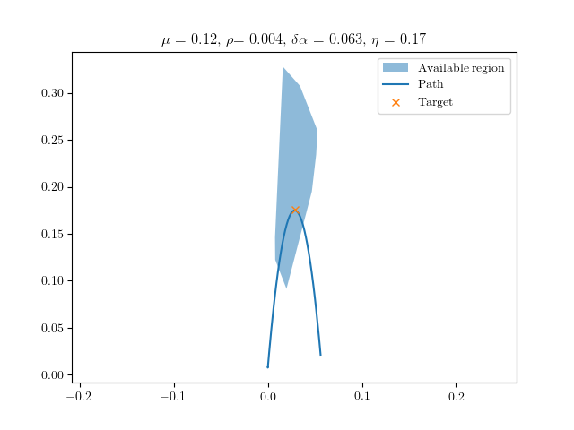

# Inverse Design of Snap-Actuated Jumping Robots

[Paper](https://arxiv.org/pdf/2408.10470)

## Overview

This project involves an inverse design process for optimizing the parameters of a jumping robot to achieve specific target trajectories. The script `inverse_design.py` uses a trained model to predict the trajectory and optimize design parameters through simulations.

<div align="center">
  
</div>

## Prerequisites

- [Ubuntu 18.04 or above](https://ubuntu.com/tutorials/install-ubuntu-desktop#1-overview)
- Python3 and dependencies
- C++ dependencies

## Installation

1. Clone the repository:
   ```bash
   git clone https://github.com/DezhongT/Jumping_Robot.git
   cd Jumping_Robot
   ```

2. Create environment 
   ```bash
   conda create -n jumpingrobot python=3.10
   conda activate jumpingrobot
   ```

3. Install Python dependencies
   ```base
   pip install -r requirements.txt
   ```
   
4. Install C++ dependencies

- **Note**: Some of these packages are installed to the system library for convenience. You may want to install locally to e.g., `~/.local` to avoid conflicts with system libraries. Add the `cmake` flag: `-D CMAKE_INSTALL_PREFIX=~/.local`. Then `sudo` is not required to install. You'll need to ensure subsequent builds know where to find the build libraries.

- [Eigen 3.4.0](http://eigen.tuxfamily.org/index.php?title=Main_Page)
  - Eigen is used for various linear algebra operations.
  - The project is built with Eigen version 3.4.0 which can be downloaded [here](https://gitlab.com/libeigen/eigen/-/releases/3.4.0). After downloading the source code, install through cmake as follows.
    ```bash
    cd eigen-3.4.0 && mkdir build && cd build
    cmake ..
    sudo make install
    ```
- [SymEngine](https://github.com/symengine/symengine)
  - SymEngine is used for symbolic differentiation and function generation.
  - Before installing SymEngine, LLVM is required which can be installed most easily via a package manager:
    - **Ubuntu**: `sudo apt-get install llvm`
  - Afterwards, install SymEngine from source using the following commands:
    ```bash
    git clone https://github.com/symengine/symengine
    cd symengine && mkdir build && cd build
    cmake -D WITH_LLVM=on -D BUILD_BENCHMARKS=off -D BUILD_TESTS=off ..
    make -j4
    sudo make install
    ```

- [Intel oneAPI Math Kernel Library (oneMKL)](https://www.intel.com/content/www/us/en/developer/tools/oneapi/onemkl-download.html?operatingsystem=linux&distributions=webdownload&options=online)
  - Necessary for access to Pardiso, which is used as a sparse matrix solver.
  - Intel MKL is also used as the BLAS / LAPACK backend for Eigen.
  - **Ubuntu**: Follow the below steps.
    ```bash
    cd /tmp
    wget https://registrationcenter-download.intel.com/akdlm/irc_nas/18483/l_onemkl_p_2022.0.2.136.sh

    # This runs an installer, simply follow the instructions.
    sudo sh ./l_onemkl_p_2022.0.2.136.sh
    ```
  - Add one of the following to your .bashrc so that cmake can find the MKL library. Change the directory accordingly if your MKL version is different. 
   Note that older versions require setting `MKLROOT` while newer versions require `MKL_DIR`.
   You can find out which one from the cmake error message.
    ```bash
    export MKLROOT=/opt/intel/oneapi/mkl/2022.0.2   # for older versions
    export MKL_DIR=/opt/intel/oneapi/mkl/2024.2     # for newer versions
    ```

- [OpenGL / GLUT](https://www.opengl.org/)
  - OpenGL / GLUT is used for rendering the knot through a simple graphic.
  - Simply install through apt package manager:
    - **Ubuntu**: `sudo apt-get install libglu1-mesa-dev freeglut3-dev mesa-common-dev`

- [Lapack](https://www.netlib.org/lapack/) (*included in MKL*)


## Usage

1. Configure the simulation engine
   ```bash
   cd simulations
   mkdir build && cd build
   cmake ..
   make -j4
   cd ../..
   ```

2. (Optional) To simulate the jumping robot with customized setting parameters, run
   ```bash
   ./simulations/simDER ./simulations/option.txt
   ```
   The parameters are specified in the ```option.txt``` with specifications as follows (SI units):
   - ```render (0 or 1) ```- Flag indicating whether OpenGL visualization should be rendered.
   - ```saveData (0 or 1)``` - Flag indicating whether positions should be recorded.
   - ```YoungM``` - Young's modulus.
   - ```totalTime``` - Total simulation time.
   - ```deltaTime``` - Time step size.
   - ```rodRadius``` - Cross-sectional radius of the beam.
   - ```deltaLength``` - Discretized segment length.
   - ```density``` - Material density.
   - ```stol``` - A small number used in solving the linear system.
   - ```tol``` - Force tolerance.
   - ```maxIter``` - Maximum iteration.
   - ```viscosity``` - Viscosity.
   - ```stiffness``` - Stiffness.
   - ```dBar``` - ?
   - ```scaleRendering``` - ?
   - ```angleRight``` - Angle mismatch.
   - ```gVector``` - Gravitational vector.
   - ```Possion``` - Possion ratio.
   - ```totalMass``` - Total mass.
   - ```mu``` - Frictional coefficient.
   - ```epsilonV``` - ?
   - ```l1``` - Robot length.
   - ```l2``` - Robot height.
   - ```compressRatio``` - Pre-compression ratio.
   - ```h1``` - Height at the critical configuration before the snap.

   The simulation data of robot trajectory will be saved to `datafiles/` directory, with each column in the file corresponding to `time`, `x`, `y`.
   
   Using this simulation engine, we generate a trainable dataset `data/train_data.txt`, where each row represents simulation results of different trails in the following order: `alpha`, `compressL`, `mu`, `H`, `rho`, `L2`, `ymax`, `x_at_ymax`.
     
4. Train the neural network model with the jumping robot dataset for 200 epoch
   ```bash
   python3 src/train_model.py
   ```
  The loss curve are evaluated over training and test data:

  <div align="center">
    
  </div>

   The trained model will be saved to `output/checkpoints`.

5. Use the pre-trained model to determine the robot parameters to achieve the desired jump
   ```bash
   python3 src/inverse_design.py test_num:=3 plot:=True
   ```
   Arguments:
   - ```test_num```: Number of trails to run (e.g., `10`).
   - ```plot```: Flag to plot results (`True` or `False`).

   The average error and standard deviation over multiple trials are evaluated:

  <table>
    <tr>
      <td align="center"></td>
      <td align="center"></td>
      <td align="center"></td>
    </tr>
  </table>


   `The average error of the inverse design is 0.0009793610214405052, and standard deviation is 0.00023094667367617823`

5. (Supplementary) Perform the sensitivity analysis on the impact of imperfections in the design parameters, including `delta_alpha`, `epsilon`, `mu`, and `mass`.
   ```bash
   python3 src/imperfection_test.py --parameter 'delta_alpha'
   ```
   Arguments:
   - ```parameter```: design parameter to be evaluated (e.g., `delta_alpha`, `epsilon`, `mu`, `mass`).

   The relative error on the x and y axes are evaluated:
  <div align="center">
    
  </div>

   

6. (Supplementary) Perform the optimization method test, including `data-driven`, `bayesian-opt`, and `gradient-descent`.
   ```bash
   python3 src/optimization_test.py --test_type data-driven
   ```
   Arguments:
   - ```test_type```: optimization method to be evaluated (e.g., `data-driven`, `bayesian-opt`, `gradient-descent`).

   The computation speed and cost of different optimization methods are evaluated (see details in the paper).

### Citation
If our work has helped your research, please cite the following paper.
```
@article{tong2024inverse,
  title={Inverse Design of Snap-Actuated Jumping Robots Powered by Mechanics-Aided Machine Learning},
  author={Tong, Dezhong and Hao, Zhuonan and Liu, Mingchao and Huang, Weicheng},
  journal={arXiv preprint arXiv:2408.10470},
  year={2024}
}

```
